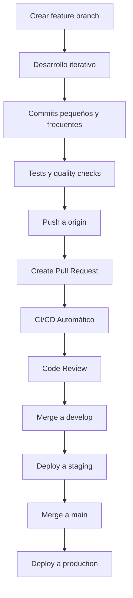

# 🚀 **OFFICIAL Git Workflow & Development Process**

**MANDATORY FOR ALL AI ASSISTANTS AND DEVELOPERS**

## **🔧 Current Branch Strategy (v0.2.05)**

### **Primary Working Model:**
```
main (production-ready)
├── v0.2.05 (current development branch - WORK HERE)
├── v0.2.06 (next version branch - future)
├── feature/compact-html-reports
├── feature/git-automation
├── hotfix/critical-fixes
└── bugfix/minor-fixes
```

### **🎯 Branch Hierarchy (ENFORCED)**

1. **`main`** - Production-ready code ONLY
   - Protected branch
   - Merge only via approved PR
   - Requires all checks to pass
   - Tagged releases only

2. **`v0.2.05`** - **CURRENT WORKING BRANCH**
   - **All AI assistants work here**
   - Feature development base
   - Quality-assured code
   - Ready for production merge

3. **`feature/description`** - Feature development
   - Created from `v0.2.05`
   - Lifespan: 1-3 days MAX
   - Merge back to `v0.2.05`
   - Auto-deleted after merge

4. **`hotfix/description`** - Critical fixes
   - Created from `main` or `v0.2.05`
   - Lifespan: Hours to 1 day
   - Immediate merge priority

### **📋 MANDATORY Branch Naming Convention**

```bash
# Feature branches
feature/compact-html-export
feature/ml-sentiment-analysis
feature/api-authentication

# Bug fixes
bugfix/story-parsing-error
bugfix/memory-leak-fix
bugfix/cli-argument-validation

# Hotfixes
hotfix/security-vulnerability
hotfix/data-corruption-fix
hotfix/performance-critical-fix

# Performance improvements
perf/json-parsing-optimization
perf/memory-usage-reduction
perf/database-query-optimization
```

### 🕒 Frecuencia de Merge

#### Merge Automático Diario
- **Features pequeñas**: Merge cada 24-48 horas
- **Features medianas**: Merge cada 3-5 días
- **Features grandes**: Dividir en sub-features más pequeñas

#### Merge a Main (Releases)
- **Releases menores**: Cada 1-2 semanas
- **Releases mayores**: Cada 3-4 semanas
- **Hotfixes**: Inmediato

### 🛠️ Flujo de Trabajo Paso a Paso

#### 1. Inicio de Feature
```bash
# Configurar git automation (una vez)
make git-setup

# Crear nueva feature branch
make branch-new
# o directamente:
git feat "Add compact HTML reports"
```

#### 2. Desarrollo Activo
```bash
# Mientras desarrollas
make test          # Ejecutar tests
make quality       # Verificar calidad
git add .
git commit -m "feat: implement data pagination"  # Auto-formateado
```

#### 3. Preparación para Merge
```bash
# Verificar que todo esté listo
make pr-ready      # Ejecuta CI completo
git push origin feat/compact-reports-20250718
```

#### 4. Pull Request
- Crear PR en GitHub
- Revisión automática por CI
- Revisión manual por equipo
- Merge automático si pasa todas las verificaciones

### 📊 Criterios de Merge

#### Merge Automático (Si cumple):
- ✅ Todos los tests pasan (88%+ success rate)
- ✅ Cobertura de código >80%
- ✅ Linting y type checking sin errores
- ✅ Security checks aprobados
- ✅ Documentación actualizada

#### Merge Manual (Requiere revisión):
- ⚠️ Cambios en arquitectura core
- ⚠️ Nuevas dependencias
- ⚠️ Cambios en API pública
- ⚠️ Modificaciones de configuración

### 🎯 Estrategia por Tipo de Cambio

#### Features (70% del desarrollo)
```bash
# Rama de vida corta: 1-3 días
git feat "Add ML sentiment analysis"
# Desarrollo iterativo
git commit -m "feat: implement TextBlob integration"
git commit -m "feat: add emotion detection"
git commit -m "feat: integrate with main analyzer"
# Merge rápido a develop
```

#### Optimizaciones (20% del desarrollo)
```bash
# Rama de vida muy corta: horas/1 día
git perf "Optimize memory usage in JSON parsing"
# Cambios focalizados
git commit -m "perf: implement streaming JSON parser"
git commit -m "perf: add memory profiling"
# Merge inmediato
```

#### Bugfixes (10% del desarrollo)
```bash
# Rama de vida inmediata: horas
git fix "Fix story count showing zero"
# Corrección directa
git commit -m "fix: correct Pydantic validation in Media model"
# Merge inmediato a develop o main
```

### 📈 Métricas de Flujo

#### Objetivos de Velocidad
- **Feature branches**: Max 3 días de vida
- **Commits por día**: 3-5 commits pequeños
- **PRs por semana**: 5-7 PRs
- **Merge rate**: 95% de PRs aprobados automáticamente

#### Métricas de Calidad
- **Test success rate**: >88% (actual)
- **Code coverage**: >80% (objetivo)
- **Security issues**: 0 críticos
- **Documentation**: 100% APIs documentadas

### 🔄 Ciclo de Vida de una Feature



### 🚀 Comandos Esenciales

#### Setup Inicial
```bash
# Configurar entorno completo
make setup-dev

# Instalar git automation
make git-setup
```

#### Desarrollo Diario
```bash
# Crear nueva feature
make branch-new

# Verificar durante desarrollo
make quick-check

# Preparar para commit
make commit-ready

# Preparar para PR
make pr-ready
```

#### Monitoreo
```bash
# Ver historial de branches
make branch-history

# Estado actual
make status

# Configuración
make git-config
```

### 🎨 Estrategia de Releases

#### Versioning Automático
- **Patch** (0.2.X): Bugfixes, optimizaciones menores
- **Minor** (0.X.0): Nuevas features, mejoras
- **Major** (X.0.0): Cambios arquitectónicos, breaking changes

#### Release Schedule
- **Sprints**: 2 semanas
- **Minor releases**: Cada sprint
- **Major releases**: Cada 2-3 meses
- **Hotfixes**: Según necesidad

### 📋 Checklist de Desarrollo

#### Antes de Commitear
- [ ] Tests pasan localmente
- [ ] Linting sin errores
- [ ] Type checking correcto
- [ ] Documentación actualizada

#### Antes de PR
- [ ] CI completo pasa
- [ ] Cobertura mantenida
- [ ] Security checks OK
- [ ] Changelog actualizado

#### Antes de Merge
- [ ] Revisión de código
- [ ] Tests de integración
- [ ] Performance no degradada
- [ ] Compatibilidad verificada

### 🎯 Beneficios del Flujo

1. **Velocidad**: Merges rápidos y frecuentes
2. **Calidad**: Verificación automática continua
3. **Trazabilidad**: Historial completo de cambios
4. **Reversibilidad**: Fácil rollback si hay problemas
5. **Colaboración**: Flujo claro para todo el equipo

### 🔧 Personalización

El sistema es configurable via `.git-automation.json`:

```json
{
  "base_branch": "main",
  "auto_version": true,
  "merge_frequency": "daily",
  "require_tests": true,
  "auto_cleanup": true
}
```

### 📞 Soporte

Si tienes dudas sobre el flujo:
1. Consulta `make workflow-example`
2. Revisa `make branch-history`
3. Usa `make branch-new` para workflow interactivo

Este flujo garantiza desarrollo ágil manteniendo la calidad enterprise que caracteriza al proyecto.
